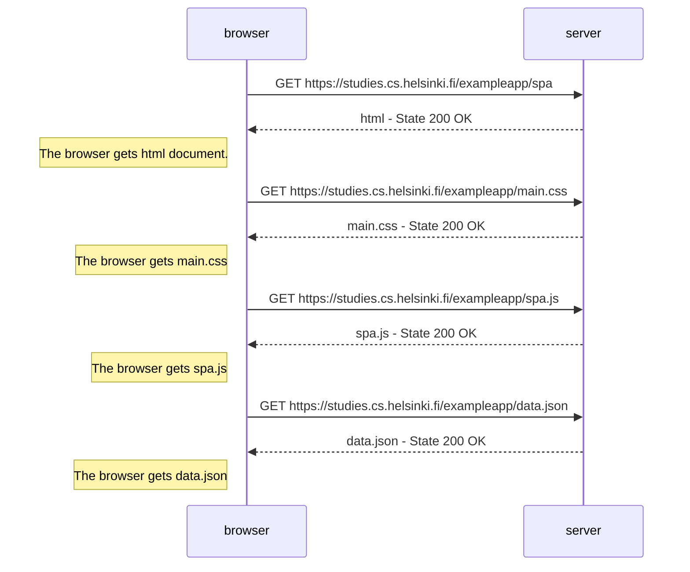

```mermaid
sequenceDiagram
    participant browser
    participant server
    browser->>server: GET https://studies.cs.helsinki.fi/exampleapp/spa
    server-->>browser: html - State 200 OK
    Note left of browser: The browser gets html document.
    browser->>server: GET https://studies.cs.helsinki.fi/exampleapp/main.css
    server-->>browser: main.css - State 200 OK
    Note left of browser: The browser gets main.css
    browser->>server: GET https://studies.cs.helsinki.fi/exampleapp/spa.js
    server-->>browser: spa.js - State 200 OK
    Note left of browser: The browser gets spa.js
    browser->>server: GET https://studies.cs.helsinki.fi/exampleapp/data.json
    server-->>browser: data.json - State 200 OK
    Note left of browser: The browser gets data.json
```
