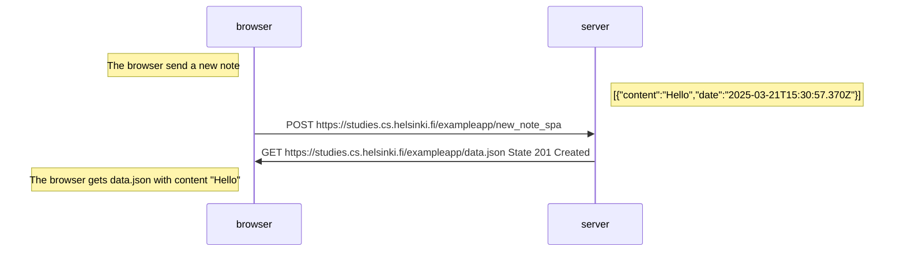

```mermaid
sequenceDiagram
Note left of browser: The browser send a new note
Note right of server: [{"content":"Hello","date":"2025-03-21T15:30:57.370Z"}] 
browser->>server: POST https://studies.cs.helsinki.fi/exampleapp/new_note_spa 
server->>browser: GET https://studies.cs.helsinki.fi/exampleapp/data.json State 201 Created
Note left of browser: The browser gets data.json with content "Hello"
```
